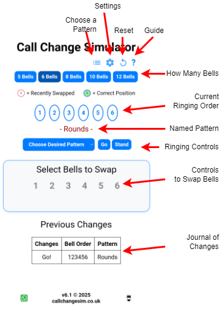

# A Guide to the Page Layout

- **How Many Bells** - Self Explanatory
- **Current Ringing Order** - The order the bells are currently ringing. These aren't touch sensitive, use the controls below.
- **Named Pattern** - This appears if the order of bells ringing corresponds to a named pattern
- **Ringing Controls**
    - **Change Desired Pattern** - Select a pattern that make the ringing order above go green when achieved
    - **Go** - Start the ringin'
    - **Stand** - Stop the ringing at the end of a change
- **Controls to Swap Bells** - Select two bells to swap: the first selected bell shows in blue until the second is pressed
- **Journal of Changes** - A list, with the newest first, of changes you've made.

### And Along the Top

- **Choose a Pattern** - Provides the same functions as **Change Desired pattern** above, via an alternative interface
- **Settings** - See [Settings](../settings)
- **Reset** - Clears everything back to rounds for your selected number of bells
- **Guide** - Opens a handy quick reference guide

