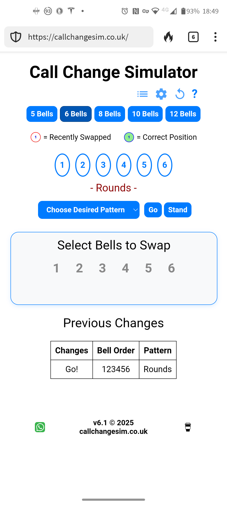

# Getting Started with Call Change Simulator

Here's how to ring a short sequence of changes on Call Change Simulator, the simple "Queens and Back" sequence.

1. Open the page [https://callchangesim.co.uk](https://callchangesim.co.uk) and leave everything at defaults. You should see this page. To understand the components of the display, refer to the page  
`TODO: Need the mkdocs method for cross reference`  
`TODO: Resize Pictures`  
`TODO: Need to blur phone status stuff`  
  
0. Press the Go button	
	You'll notice that under the round numbers showing the current bell order it says `- Rounds -`. That's because the bells are, indeed, ringing rounds. Let's change that
0. In the "Select Bells to Swap" box, press `2` followed by `3`. The following will happen:
	1. The order of the bells played will change - you'll hear this
	0. The displayed order of the bells (in the circles) will change: "2" will be after "3"
	0. There will be red borders around the circled numbers "3" and "2": this is because they moved at the last change
	0. The word `- Rounds -` will disappear. That's because we're not ringing rounds any more.
	0. At the bottom of the screen under "Previous Changes" you'll see the called change and the new order. Each time you make a change a new line will be added to the **top** of the list. The line at the top of this section should always show the same order as is currently ringing.
0. Now we'll make another change: we'll press `4` followed by `5`.  
	You'll see that the order of ringing bells has changed again, the latest changed pair are highlighted in red and a new line has been added at the top of the journal
0. One more change: press `2` followed by `5`  
    Another pair of bells has swapped and you'll hear a familiar sounding pattern. You'll notice that `- Queens -` has appeared under the circled numbers. That's because this pattern is, indeed, called Queens. In the journal at the bottom you'll also see that this change is labelled as Queens
0. Now lets get back to Rounds. To do this we make the following changes:
	1. `5` then `2` ("Five to two")
	0. "Three to Two"
	0. "Five to Four"  
	If that went right, the two indicators (under the circled numbers and in the journal) should both say `Rounds`

Congratulations, you've rung to Queens and back! Now refresh the page, start again and do that without referring to these notes. Pick one of the inside bells and, at each change, take note of the two bells ahead (under you) and one bell behind (over you) as well as your position. Keeping track of these bells will help you when you get called.

