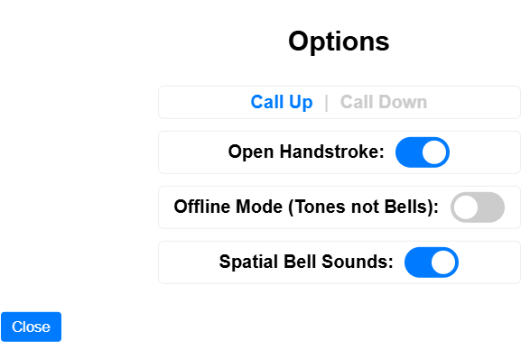

# A Guide to the Settings Page

- **Call Up | Call Down** - Whether to use up or down changes  
  `TODO: Find a good link to reference up and down changes`
- **Open Handstroke** - Whether to add a gap before the handstroke of Firsts place bell (recommended)
- **Offline Mode** - Switch between the bell tones (which are only available when you're online) or beeps made by your device (which are still available when you're offline)
- **Spatial Bell Sounds** - `TODO: this doesn't seem to make any difference on my device`
  

