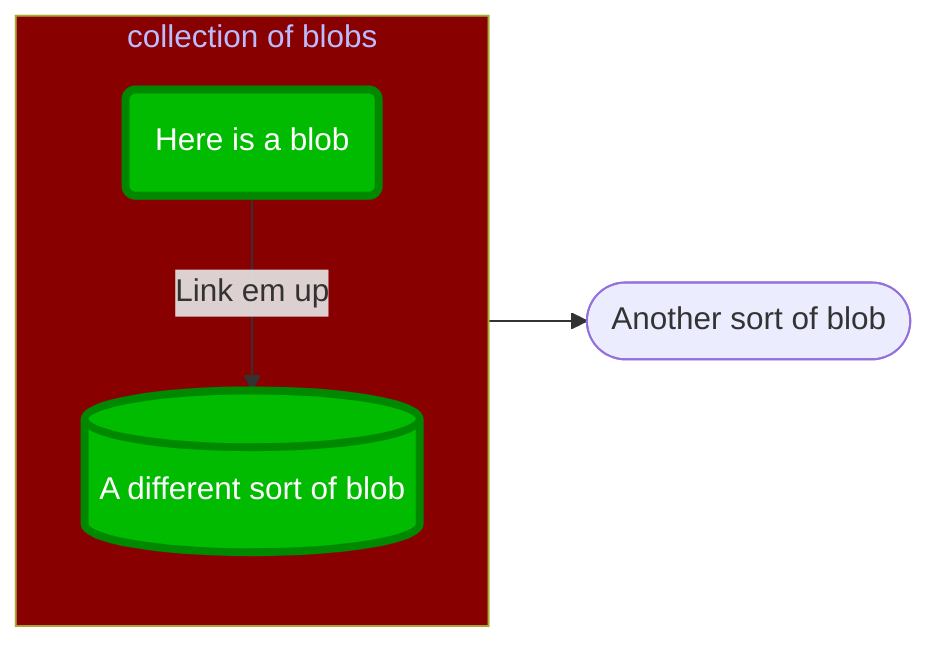
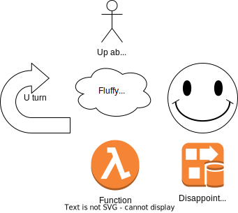

# Pictures for Markdown pages

There are three sorts of illustrations to be used on pages:

- Embedded Diagrams
    - Simple drawings added using a code block
- Drawn diagrams
    - Complex drawings that must be created in a drawing tool
    - Stored and embedded as SVG files
- Graphic content
    - Raster content such as screen grabs
    - Either png (prefered) or jpg files
    - Content that is unlikely to be updated

## Embedded diagrams

Simple diagrams should be embedded in a Mermaid code block. The syntax for Mermaid is concise and can be found at [https://mermaid-js.github.io/mermaid/](https://mermaid-js.github.io/mermaid/). Mkdocs has been configured to include a Mermaid interpreter in the Javascript passed to the client's browser, which is where the diagram is rendered.

Note, the mermaid interpreter adds over a megabyte to the page's size.

_An alternative is [Graviso](https://www.gravizo.com/) where the description of figures created in [DOT](https://en.wikipedia.org/wiki/DOT_(graph_description_language)) are submitted to a web service for rendering. Were we to adopt this, a hosted instance (with subscription) with branding removed would work well._ 


### Sample Diagram



The source code for this diagram is as follows (it is placed within a code block of type "mermaid" - see the source code of this page)

```
flowchart LR

  subgraph sg1 [collection of blobs]
  direction TB

    item1(Here is a blob)
    item2[(A different sort of blob)]

  end

  item3([Another sort of blob])

%% flows

  item1 -->|Link em up| item2
  sg1 --> item3

%% formatting

  classDef class1 fill:#0b0,stroke:#080,stroke-width:4px,color:#fff,stroke-dasharray;
  classDef class2 fill:#800,color:#bbf;
  
  class item1,item2 class1;
  class sg1 class2;
```


### Alternatives to Mermaid

_An alternative is [Graviso](https://www.gravizo.com/) where the description of figures created in [DOT](https://en.wikipedia.org/wiki/DOT_(graph_description_language)) are submitted to a web service for rendering. Were we to adopt this, a hosted instance (with subscription) with branding removed would work well._ 


## Drawn Diagrams

The preferred solution for drawn diagrams is to use _drawio_ as follows:

- Diagrams are saved as SVG with the source code embedded (i.e. NOT as .drawio files)
- Diagrams are kept in a sub-directory `svg` of the directory where the markdown source lives
- There is a single page in each drawing
- Diagrams are committed to the git repo
- The SVG diagrams are referenced from the markdown documents using relative paths
- Diagrams have descriptive Alt text

### Sample diagram



## Graphic Content

Graphic content is placed alongside the page source in the same way as drawn diagrams:

- Images are placed into a sub-directory (`jpg` or `png`) of the directory where the markdown source lives
- Images are committed to the git repo
- Images are referenced from the markdown documents using relative paths
- Images have descriptive Alt text


### Sample Image

